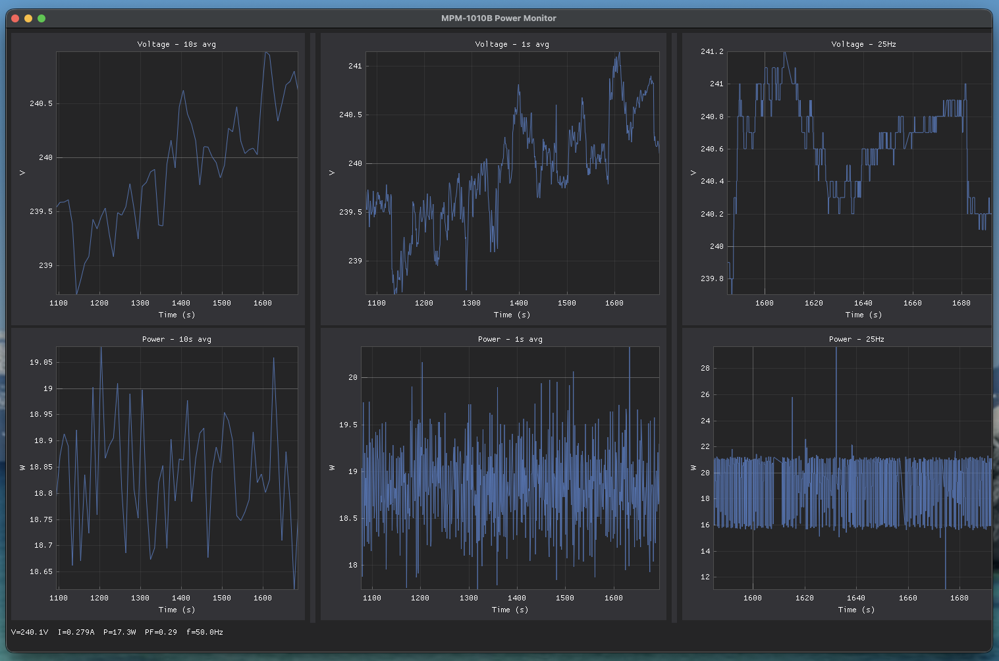

# MPM-1010B Power Monitor

Real-time AC power monitoring for the Matrix MPM-1010B power meter with multi-timescale visualization, native GUI, terminal graphs, and data logging.



## Features

- **Multi-timescale display**: View data at multiple time resolutions simultaneously (e.g., 25Hz live + 1s avg + 10s avg)
- **Native GUI**: Hardware-accelerated graphs with draggable column splitters
- **Terminal graphs**: Braille-character plots for SSH/headless use
- **Text output**: Tab-separated values for piping to other tools
- **File logging**: TSV output with configurable averaging and optional min/max tracking
- **Persistent history**: Binary storage with cascading aggregation, survives restarts
- **Force takeover**: Automatically kill other processes holding the serial port

## Requirements

- Python 3.12+
- [uv](https://docs.astral.sh/uv/) (recommended) or pip
- USB-to-serial adapter (PL2303 or similar)
- [Matrix MPM-1010B power meter](https://eleshop.eu/matrix-mpm-1010b-power-meter.html)

## Quick Start

```bash
# Native GUI (recommended)
./mpm1010b-power-monitor.py --gui

# Terminal graphs
./mpm1010b-power-monitor.py --graph

# Text output
./mpm1010b-power-monitor.py
```

The script uses `uv` for automatic dependency management. Dependencies (pyserial, plotext, dearpygui) are installed on first run.

## Usage

```
usage: mpm1010b-power-monitor.py [-h] [-d DEVICE] [-f] [-p PERIOD] [-l FILE]
                                 [-L SEC] [-M] [--db [PATH]] [-w WATTS]
                                 [-v VOLTS] [--all] [-g] [--gui] [-c {2-6}]
                                 [-t CHART_TIME] [-T HISTORY_TIME]
                                 [-a AVG_PERIOD] [--scale-v MIN:MAX]
                                 [--scale-w MIN:MAX] [-m METRICS]
```

### Core Options

| Option | Description |
|--------|-------------|
| `-d, --device PATH` | Serial device path (default: `/dev/cu.PL2303G-USBtoUART3110`) |
| `-f, --force` | Kill other processes using the serial port |
| `-p, --period SEC` | Polling period in seconds (default: 0.04 = 25Hz) |

### Display Modes

| Option | Description |
|--------|-------------|
| `--gui` | Native GUI window (DearPyGui) |
| `-g, --graph` | Terminal graph mode (plotext) |
| *(default)* | Text mode with tab-separated values |

### Multi-Timescale Options

| Option | Description |
|--------|-------------|
| `-c, --columns {2-6}` | Number of time-scale columns (default: 3) |
| `-a, --avg-period SEC` | Base averaging period for cascading (default: 1.0) |
| `-t, --chart-time SEC` | Recent/live window duration (default: 60) |
| `-T, --history-time SEC` | History window duration (default: 600) |

The columns display cascading 10x time averages. With default settings (600 samples per level):

| Columns | Left → Right |
|---------|--------------|
| 2 | 10 min (1s avg), 1 min (25Hz) |
| 3 | 1.7 hr (10s avg), 10 min (1s avg), 1 min (25Hz) |
| 4 | 17 hr (100s avg), 1.7 hr (10s avg), 10 min (1s avg), 1 min (25Hz) |
| 5 | 7 days (1000s avg), 17 hr, 1.7 hr, 10 min, 1 min (25Hz) |
| 6 | 69 days (10000s avg), 7 days, 17 hr, 1.7 hr, 10 min, 1 min (25Hz) |

### Metrics Options

| Option | Description |
|--------|-------------|
| `-m, --metrics LIST` | Comma-separated metrics to plot (default: V,W) |

Available metrics:
- `V` - Voltage
- `A` - Current
- `W` - Power
- `PF` - Power Factor
- `Hz` - Frequency
- `all` - All metrics

Example: `--metrics V,W,Hz` or `-m all`

### Scale Options

| Option | Description |
|--------|-------------|
| `--scale-v MIN:MAX` | Fixed voltage axis range (e.g., `220:250`) |
| `--scale-w MIN:MAX` | Fixed power axis range (e.g., `0:100`) |

### Text Mode Options

| Option | Description |
|--------|-------------|
| `-v, --volts THRESHOLD` | Voltage change threshold for output (default: 0.5) |
| `-w, --watts THRESHOLD` | Power change threshold for output (default: 1.0) |
| `--all` | Output every reading (ignore thresholds) |

### Logging Options

| Option | Description |
|--------|-------------|
| `-l, --log FILE` | Log readings to TSV file |
| `-L, --log-period SEC` | Log averaging period (default: same as poll) |
| `-M, --log-minmax` | Include min/max columns in log |

### Persistence Options

| Option | Description |
|--------|-------------|
| `--db [PATH]` | Binary database directory (default: `./data` when enabled) |

The `--db` option enables persistent history storage. Data is saved in binary format with cascading aggregation levels matching the display columns. On restart, history is automatically reloaded and new data continues from where it left off.

Storage format:
- 52 bytes per record (timestamp + V/A/W with avg/min/max + PF/Hz avg)
- Separate files per cascade level (`level_0_1s.bin`, `level_1_10s.bin`, etc.)
- ~1.7 GB/year for all cascade levels with default settings

## Examples

```bash
# GUI with 3 time-scale columns
./mpm1010b-power-monitor.py --gui -c 3

# Terminal graph with fixed voltage scale
./mpm1010b-power-monitor.py -g --scale-v 115:125

# Log to file with 1-second averaging and min/max
./mpm1010b-power-monitor.py -l build.tsv -L 1 -M

# High-speed polling (10Hz) with GUI
./mpm1010b-power-monitor.py --gui -p 0.1

# Force takeover of serial port
./mpm1010b-power-monitor.py --gui -f

# Plot all metrics (V, A, W, PF, Hz)
./mpm1010b-power-monitor.py --gui -m all

# Plot only voltage and frequency
./mpm1010b-power-monitor.py --gui -m V,Hz

# GUI with persistent history (survives restarts)
./mpm1010b-power-monitor.py --gui --db

# Custom database path
./mpm1010b-power-monitor.py --gui --db /path/to/data
```

## Output Format

### Text Mode

```
# timestamp	V	A	W	PF	Hz
14:32:01	121.50	0.450	54.68	0.998	60.01
14:32:03	121.48	0.455	55.27	0.999	60.00
```

### Log File (TSV)

```
# MPM-1010B power log
# started: 2026-01-10T14:32:01.234
timestamp	elapsed_s	V	A	W	PF	Hz
2026-01-10T14:32:02.234	1.00	121.50	0.450	54.68	0.998	60.01
```

With `-M` (min/max):

```
timestamp	elapsed_s	V	V_min	V_max	A	A_min	A_max	W	W_min	W_max	PF	Hz
```

## Serial Protocol

The MPM-1010B uses a simple serial protocol:

- **Baud**: 9600 8N1
- **Poll command**: `?` (0x3F)
- **Response**: 21 bytes starting with `!` (0x21)

Response format (BCD encoded):
| Bytes | Field |
|-------|-------|
| 0 | Start byte (0x21) |
| 1-4 | Voltage |
| 5-8 | Current |
| 9-12 | Power |
| 13-16 | Power factor |
| 17-20 | Frequency |

Each 4-byte BCD field encodes a decimal value with the high nibble indicating decimal point position.

## Architecture

```
MeterReader          - Serial communication and BCD decoding
    |
    v
CascadingBuffer      - Multi-level time series with 10x averaging cascade
    |
    +---> Display    - Visualization (GUI, terminal graph, or text)
    |
    +---> DataSink   - File logging (TSV) or binary persistence
```

The `CascadingBuffer` maintains multiple `TimeSeries` at different time resolutions:
- Level 0: Raw samples at poll rate
- Level 1: Averaged at `avg_period` (e.g., 1s)
- Level 2+: Cascading 10x averages (10s, 100s, ...)

## License

MIT
